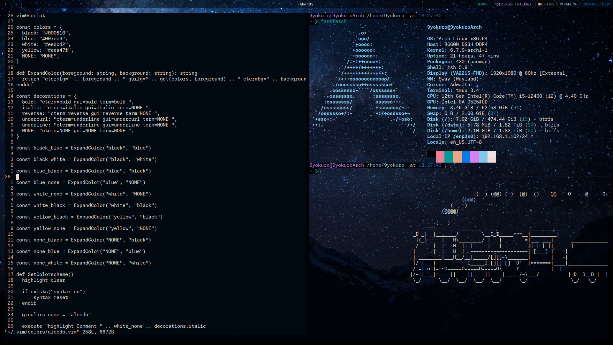

= dotfiles

== General
=== Requirements
* A Unix-like operating system
* https://www.nerdfonts.com[Nerd Font] (Recommend JetBrains Mono Nerd Font)

=== Optional
* https://nixos.org[Nix]
* https://github.com/nix-community/home-manager[home-manager]

== Sway
=== Requirements
* https://git.sr.ht/~emersion/grim[grim]
* https://github.com/emersion/mako[mako]
* https://github.com/adobe-fonts/source-sans[source-sans]
* https://github.com/swaywm/swaybg[swaybg]
* https://github.com/Alexays/Waybar[Waybar]

== Vim
=== Requirements
* *v9.0.0000* or later
