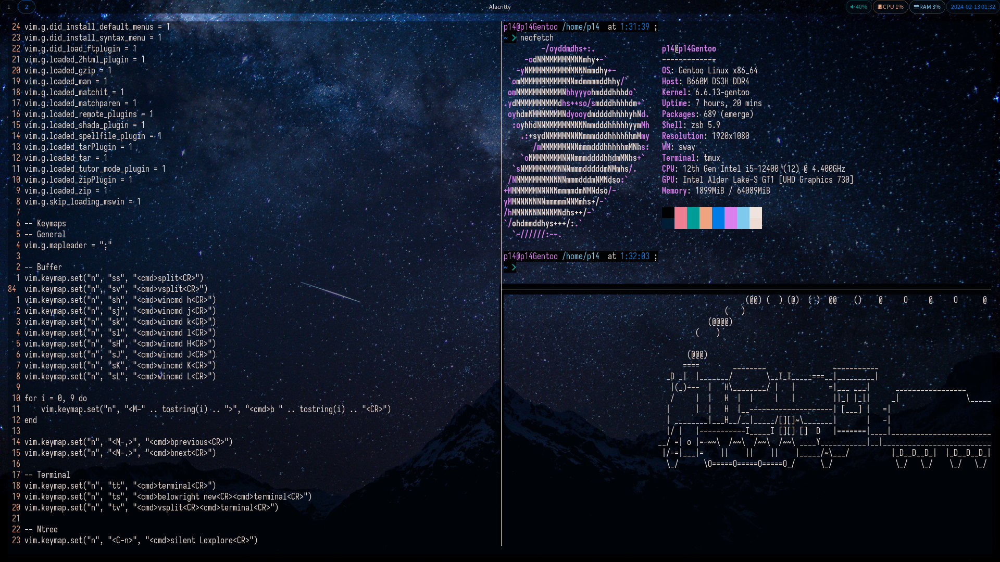

# dotfiles


## Contents
- Alacritty config
- BspWM config
- Clangd config
- Dunst config
- I3WM config
- Neovim config
- Picom config
- Polybar config
- Rofi config
- SwayWM config
- Tmux config
- Waybar config
- Wezterm config
- Zsh config

## Requirements
### General
- [Nerd Font](https://www.nerdfonts.com/)

## Installation
Use [sdmw](https://github.com/p1486/sdmw):
```
git clone https://github.com/p1486/dotfiles/tree/main
cd dotfiles
sdmw install
```
Or use `scripts/install.py`
```
git clone https://github.com/p1486/dotfiles/tree/main
cd dotfiles
python scripts/install.py install
```
